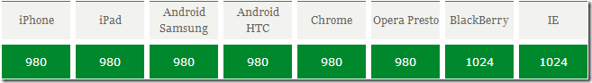

## viewport的使用说明
移动开发中，我们经常用到meta标签的viewport这一个使用。

```
<meta name="viewport" content="initial-scale=1">
```

在做多设备灵活布局设计的时候，这一个标签的使用非常有用。

通俗的讲，移动设备上的viewport就是设备的屏幕上能用来显示我们的网页的那一块区域，在具体一点，就是浏览器上(也可能是一个app中的webview)用来显示网页的那部分区域。

但viewport又不局限于浏览器可视区域的大小，**它可能比浏览器的可视区域要大，也可能比浏览器的可视区域要小**。在默认情况下，一般来讲，移动设备上的viewport都是要大于浏览器可视区域的，这是因为考虑到移动设备的分辨率相对于桌面电脑来说都比较小，所以为了能在移动设备上正常显示那些传统的为桌面浏览器设计的网站，移动设备上的浏览器都会把自己默认的viewport设为980px或1024px（也可能是其它值，这个是由设备自己决定的），但带来的后果就是浏览器会出现横向滚动条，因为浏览器可视区域的宽度是比这个默认的viewport的宽度要小的。下图列出了一些设备上浏览器的默认viewport的宽度。



如图，反正viewport就是指，可视区域的实际大小，如果比你的屏幕大，那就会出现滚动条。

举个例子，如果你的移动版设计是基于320px的宽度，你可以指定viewport的宽度：

``` html
<meta name="viewport" content="width=320">
```

对于流动式布局来说，基于设备不同来设定的viewport宽度更为实用，所以让你的布局宽度和移动设备宽度相符：

``` html
<meta name="viewport" content="width=device-width">
```

还可以设置缩放程度
``` html
<meta name="viewport" content="initial-scale=1">
```
这个保证你的设计在一打开的时候就呈现1:1的比例。不需要设定缩放比例。你可以通过如下方式方式用户改变页面大小：