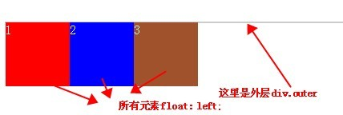

## 清浮动方法总结



因为里面的元素全部都脱离文档流，所以必须清浮动才能把父元素撑开。

### 方法1
添加新的元素 、应用 clear：both；

``` html
<div class="outer">
    <div class="div1">1</div>
    <div class="div2">2</div>
    <div class="div3">3</div>
    <div class="clear"></div>
</div>
```

``` css
.clear{clear:both; height: 0; line-height: 0; font-size: 0}
```

这个方法存在缺陷，因为它增加了无用标签，使页面结构更加复杂，不利于页面优化。

### 方法2
父级div定义 overflow: auto（注意：是父级div也就是这里的 div.outer）

``` css
.over-flow{
    overflow: auto; zoom: 1; //zoom: 1; 是在处理兼容性问题
}
```

### 方法3
after 方法：（注意：作用于浮动元素的父亲）

种方法清除浮动是现在网上最拉风的一种清除浮动，他就是利用:after和:before来在元素内部插入两个元素块，从面达到清除浮动的效果。其实现原理类似于clear:both方法，只是区别在于:clear在html插入一个div.clear标签，而outer利用其伪类clear:after在元素内部增加一个类似于div.clear的效果

``` css
/*==for IE6/7 Maxthon2==*/
 .outer :after {clear:both;content:'.';display:block;width: 0;height: 0;visibility:hidden;}/*==for FF/chrome/opera/IE8==*/
```


### 终极方案
新版的清浮动方案最终是一下两个，因为清浮动，本质上(我认为)是触发BFC来计算上下文高度。BFC即是决定一个块级元素内部中的块级元素怎样摆放。而BFC的其中一个规则就是，触发BFC之后重新计算高度，内部的浮动元素也得加上去。所以只要触发BFC，就能撑开父元素，因为父元素重新计算了高度。

构成Block Formatting Context的方法有下面几种：

　　float的值不为none。

　　overflow的值不为visible。

　　display的值为table-cell, table-caption, inline-block中的任何一个。

　　position的值不为relative和static。

　　很明显，float和position不合适我们的需求。那只能从overflow或者display中选取一个。

　　因为是应用了.clearfix和.menu的菜单极有可能是多级的，所以overflow: hidden或overflow: auto也不满足需求

　　（会把下拉的菜单隐藏掉或者出滚动条），那么只能从display下手。

　　我们可以将.clearfix的display值设为table-cell, table-caption, inline-block中的任何一个

　　但是display: inline-block会产生多余空白，所以也排除掉。

　　剩下的只有table-cell, table-caption，为了保证兼容可以用display: table来使.clearfix形成一个Block Formatting Context

　　因为display: table会产生一些匿名盒子，这些匿名盒子的其中一个（display值为table-cell）会形成Block Formatting Context。

　　这样我们新的.clearfix就会闭合内部元素的浮动。

#### 最后方案1

``` css
.clearfix:after {
    content:"\200B";
    display:block;
    height:0;
    clear:both;
}
.clearfix {*zoom:1;}/*IE/7/6*/
```

content:"\200B";这个参数，Unicode字符里有一个“零宽度空格”，即 U+200B，代替原来的“.”，可以缩减代码量。而且不再使用visibility:hidden。

#### 最后方案2
``` css
.clearfix:before,.clearfix:after{
    content:"";
    display:table;
}
.clearfix:after{clear:both;}
.clearfix{
    *zoom:1;/*IE/7/6*/
}
```
