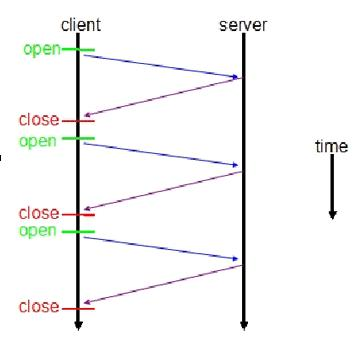
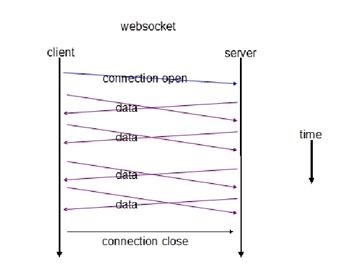

## WebSocket 机制
以下简要介绍一下 WebSocket 的原理及运行机制。

WebSocket 是 HTML5 一种新的协议。它实现了浏览器与服务器全双工通信，能更好的节省服务器资源和带宽并达到实时通讯，它建立在 TCP 之上，同 HTTP 一样通过 TCP 来传输数据，但是它和 HTTP 最大不同是：

 - WebSocket 是一种双向通信协议，在建立连接后，WebSocket 服务器和 Browser/Client Agent 都能主动的向对方发送或接收数据，就像 Socket 一样；
 - WebSocket 需要类似 TCP 的客户端和服务器端通过握手连接，连接成功后才能相互通信。

非 WebSocket 模式传统 HTTP 客户端与服务器的交互如下图所示：

使用 WebSocket 模式客户端与服务器的交互如下图：

相对于传统 HTTP 每次请求-应答都需要客户端与服务端建立连接的模式，WebSocket 是类似 Socket 的 TCP 长连接的通讯模式，一旦 WebSocket 连接建立后，后续数据都以帧序列的形式传输。在客户端断开 WebSocket 连接或 Server 端断掉连接前，不需要客户端和服务端重新发起连接请求。在海量并发及客户端与服务器交互负载流量大的情况下，极大的节省了网络带宽资源的消耗，有明显的性能优势，且客户端发送和接受消息是在同一个持久连接上发起，实时性优势明显。

### 特点
首先，相对于Http这种非持久的协议来说，WebSocket是一种持久化的协议。

举例说明：

（1）Http的生命周期通过Request来界定，也就是Request一个Response，那么在Http1.0协议中，这次Http请求就结束了。

在Http1.1中进行了改进，是的有一个Keep-alive，也就是说，在一个Http连接中，可以发送多个Request，接收多个Response。

但是必须记住，在Http中一个Request只能对应有一个Response，而且这个Response是被动的，不能主动发起。

（2）WebSocket是基于Http协议的，或者说借用了Http协议来完成一部分握手，在握手阶段与Http是相同的。

### websocket和http长连接的对比(来自没别人的comments)
    长连接应该是，客户端往服务器端发送一个http请求，然后服务端等到任务完成之后才返回。这个任务完成的时间可以是几个小时，而一般的http请求得到返回的时间没那么长。客户端得到服务器端返回的信息之后，马上又发一个请求，然后服务器端继续前面的事情，也就是不立即返回，等有了新的信息之后再返回。
    websocket是指客户端和服务器之间建立一个websockt连接，然后客户端可以给服务器发信息，服务器也可以给客户端发信息。从行为上来说，对比长连接，服务器的不需要把请求hold住，而客户端也不需要接收一次信息后再立刻发送请求。
    在没有websocket之前，只有长连接可以选择。

comments2

    你可以把 WebSocket 看成是 HTTP 协议为了支持长连接所打的一个大补丁，它和 HTTP 有一些共性，是为了解决 HTTP 本身无法解决的某些问题而做出的一个改良设计。在以前 HTTP 协议中所谓的 keep-alive connection 是指在一次 TCP 连接中完成多个 HTTP 请求，但是对每个请求仍然要单独发 header；所谓的 polling 是指从客户端（一般就是浏览器）不断主动的向服务器发 HTTP 请求查询是否有新数据。这两种模式有一个共同的缺点，就是除了真正的数据部分外，服务器和客户端还要大量交换 HTTP header，信息交换效率很低。它们建立的“长连接”都是伪.长连接，只不过好处是不需要对现有的 HTTP server 和浏览器架构做修改就能实现。
    
    WebSocket 解决的第一个问题是，通过第一个 HTTP request 建立了 TCP 连接之后，之后的交换数据都不需要再发 HTTP request了，使得这个长连接变成了一个真.长连接。但是不需要发送 HTTP header就能交换数据显然和原有的 HTTP 协议是有区别的，所以它需要对服务器和客户端都进行升级才能实现。在此基础上 WebSocket 还是一个双通道的连接，在同一个 TCP 连接上既可以发也可以收信息。此外还有 multiplexing 功能，几个不同的 URI 可以复用同一个 WebSocket 连接。这些都是原来的 HTTP 不能做到的。
    
    
    
    
    