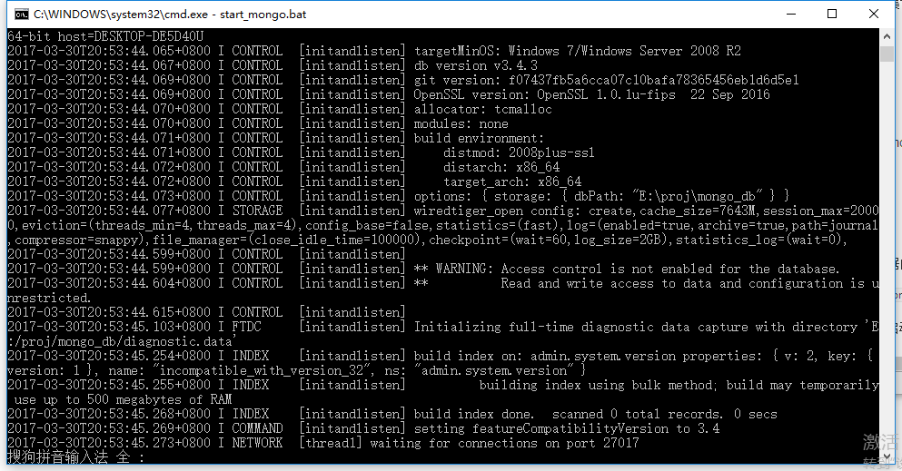

## MongoDB
MongoDB 是一个基于分布式文件存储的数据库。由 C++ 语言编写。旨在为 WEB 应用提供可扩展的高性能数据存储解决方案。
MongoDB 是一个介于**关系数据库和非关系数据库之间**的产品，是非关系数据库当中功能最丰富，最像关系数据库的。


MongoDB 将数据存储为一个文档，数据结构由键值(key=>value)对组成。MongoDB 文档类似于 JSON 对象。字段值可以包含其他文档，数组及文档数组。

mongodb中有三元素：**数据库，集合，文档**，其中“集合”

就是对应关系数据库中的“表”，“文档”对应“行”。

### 使用
首先必须得安装mongodb这个应用

安装好以后，每次执行都要去安装目录下的bin处执行mongod。

比如在windows下，默认安装目录为C:\Program Files\MongoDB\Server\3.4\bin

运行mongod.exe可以启动mongo服务器

运行的时候需要指定一个位置作为mongodb的存放数据的地方。

``` bat
C:\"Program Files"\MongoDB\Server\3.4\bin\mongod.exe --dbpath=E:\proj\mongo_db
```

用dbpath指定对应的位置，然后就可以看到数据库的启动了。



### mongoose管理数据库
Node.js有针对MongoDB的数据库驱动：mongodb。你可以使用“npm install mongodb”来安装。

不过直接使用mongodb模块虽然强大而灵活，但有些繁琐，我就使用mongoose吧。

mongoose构建在mongodb之上，提供了**Schema、Model和Document**对象，用起来更为方便。

我们可以用Schema对象定义文档的结构（类似表结构），可以定义字段和类型、唯一性、索引和验证。Model对象表示集合中的所有文档。Document对象作为集合中的单个文档的表示。


