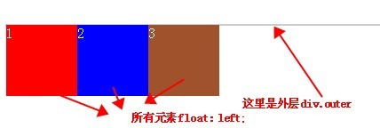

## 清浮动方法总结



因为里面的元素全部都脱离文档流，所以必须清浮动才能把父元素撑开。

### 方法1
添加新的元素 、应用 clear：both；

``` html
<div class="outer">
    <div class="div1">1</div>
    <div class="div2">2</div>
    <div class="div3">3</div>
    <div class="clear"></div>
</div>
```

``` css
.clear{clear:both; height: 0; line-height: 0; font-size: 0}
```

这个方法存在缺陷，因为它增加了无用标签，使页面结构更加复杂，不利于页面优化。

### 方法2
父级div定义 overflow: auto（注意：是父级div也就是这里的 div.outer）

``` css
.over-flow{
    overflow: auto; zoom: 1; //zoom: 1; 是在处理兼容性问题
}
```

### 方法3
after 方法：（注意：作用于浮动元素的父亲）

种方法清除浮动是现在网上最拉风的一种清除浮动，他就是利用:after和:before来在元素内部插入两个元素块，从面达到清除浮动的效果。其实现原理类似于clear:both方法，只是区别在于:clear在html插入一个div.clear标签，而outer利用其伪类clear:after在元素内部增加一个类似于div.clear的效果

``` css
/*==for IE6/7 Maxthon2==*/
 .outer :after {clear:both;content:'.';display:block;width: 0;height: 0;visibility:hidden;}/*==for FF/chrome/opera/IE8==*/
```