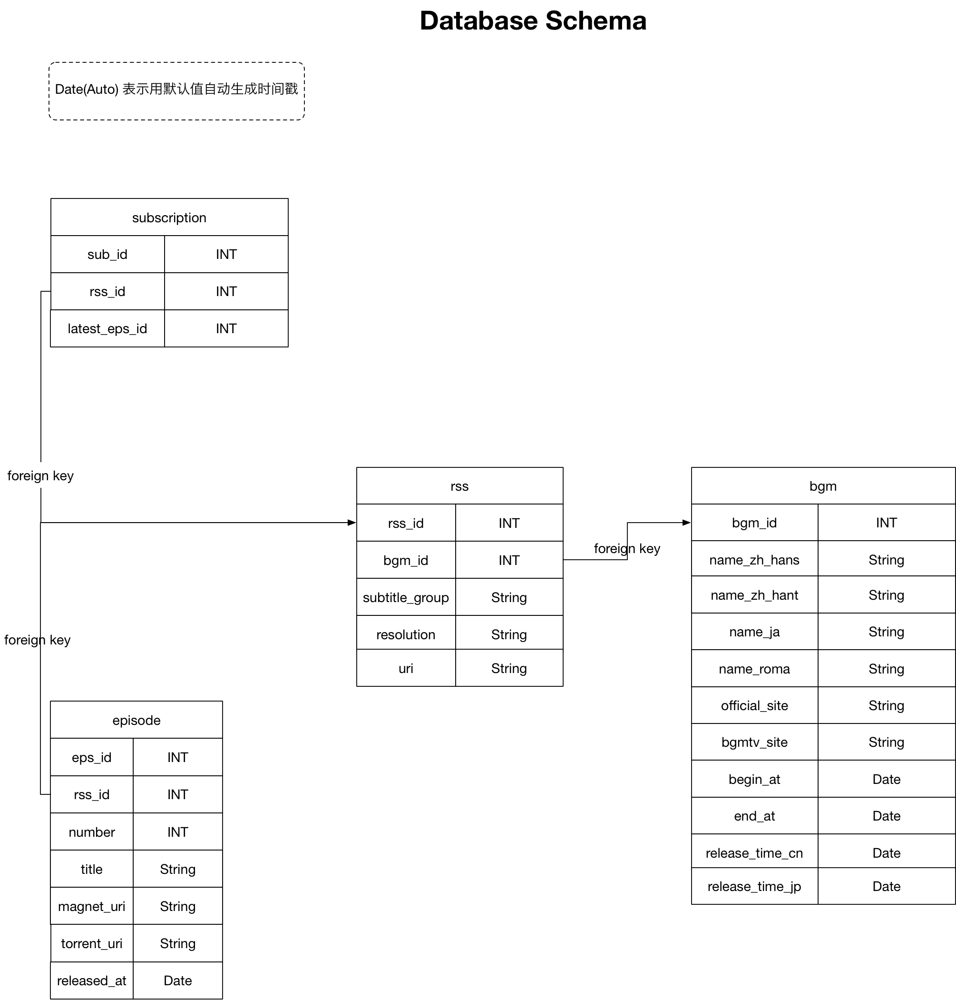

## 数据库的说明

如图所示

 - bgm是每一个新番的动画信息，每一个季度出来后都会固定。
 - rss是每一个动画衍生出来的订阅，也是固定的，每一个动画都可能产生不同的订阅，比如根据动画的分辨率不同，字幕组的不同会产生不同的订阅。
 - subscription是用户添加一个订阅的时候所用的表，是动态添加的记录。每当用户添加一个订阅，便添加一条记录指向rss。
 - episode是每一集具体的动画，一旦有新的集数更新，episode表便会插入新的记录。